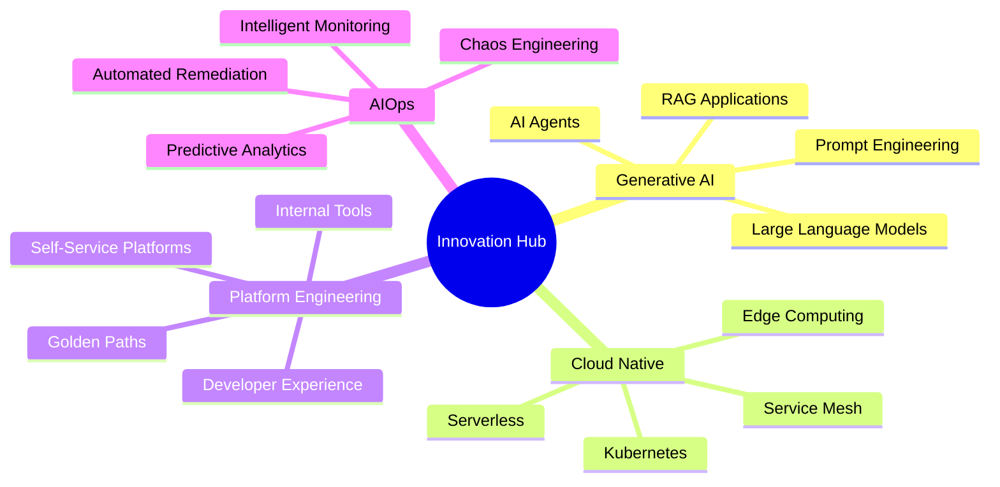

# Hi there, I'm Imdad Mahammed! 

<div align="center">
  
[](https://git.io/typing-svg)

</div>

<div align="center">
  
 **Generative AI Architect | Site Reliability Engineer | DevOps | Cloud Architect | Automation Evangelist | AI/ML Innovation Leader**

</div>

<div align="center">
  
[](https://github.com/imdadMahammed)
[](https://github.com/imdadMahammed)
[](https://www.linkedin.com/in/imdadMahammed)
[](https://twitter.com/ImdadKmd)

</div>

---

##  **About Me**

Welcome to my GitHub profile! With **11+ years of experience**, I specialize in **GenAI, Platform Engineering, Cloud Infrastructure, AI/ML, Automation, and Performance Optimization**. I am passionate about designing scalable, resilient, and highly available systems for modern cloud-native applications.

<div align="center">
  
```ascii
    ╔═══════════════════════════════════╗
    ║   MISSION: Transforming Ideas   ║
    ║    into Intelligent Solutions    ║
    ╚═══════════════════════════════════╝
```

</div>

### ** Technical Leadership & Innovation**

-  **Currently Working On:** 
  - Architecting **petabyte-scale GenAI platforms** with distributed inference across **multi-cloud environments**
  - Building **LLMOps pipelines** for **fine-tuning custom models** on **GPU clusters** (A100/H100)
  - Implementing **vector database architectures** (Pinecone, Weaviate, Chroma) for **enterprise RAG systems**
  - Designing **event-driven microservices** with **Apache Kafka** and **NATS** for real-time AI workloads

-  **Advanced Learning & Research:**
  - **Kubernetes advanced patterns:** Multi-tenancy, GitOps with ArgoCD, RBAC policies, and custom operators
  - **Service Mesh mastery:** Istio traffic management, security policies, observability, and canary deployments  
  - **AI/ML cutting-edge:** Transformer architectures, RLHF, prompt engineering, and model quantization
  - **Cloud-native security:** Zero-trust networking, OPA Gatekeeper, Falco runtime security, and SPIFFE/SPIRE

-  **Core Technical Expertise:**
  - ** Multi-Cloud Architecture:** Cross-cloud workload orchestration, hybrid connectivity, and disaster recovery
  - ** AI/ML Engineering:** MLOps, model serving (Triton, TorchServe), A/B testing, and AutoML pipelines
  - ** Platform Engineering:** Developer portals, golden paths, self-service infrastructure, and inner sourcing
  - ** Observability Engineering:** OpenTelemetry, distributed tracing, SLI/SLO monitoring, and chaos engineering
  - ** Security & Compliance:** Infrastructure security, policy-as-code, vulnerability management, and audit automation
  - ** Performance Engineering:** High-frequency trading systems, sub-millisecond latency optimization, and distributed caching

-  **Innovation & Research Focus:**
  - ** Edge AI & Federated Learning:** Deploying AI models on edge devices with privacy-preserving techniques
  - ** Quantum-Ready Infrastructure:** Exploring quantum computing integration and post-quantum cryptography
  - ** Real-time Stream Processing:** Complex event processing with Apache Flink, Kafka Streams, and ClickHouse
  - ** Infrastructure Automation:** Custom Kubernetes operators, Terraform modules, and policy-driven deployments

-  **Strategic Objectives:**
  - ** Operational Excellence:** Achieving 99.99% uptime with autonomous incident response and self-healing systems
  - ** Scale & Performance:** Supporting **10M+ concurrent users** with **sub-100ms P99 latency**
  - ** Cost Optimization:** Implementing **FinOps practices** for **40%+ infrastructure cost reduction**
  - ** Zero-Trust Security:** Building defense-in-depth architectures with continuous security validation

-  **Location:** Bengaluru, Karnataka, India (Open to global remote opportunities)
-  **Continuous Learning:** AWS/Azure/GCP certifications, CNCF projects contributor, and open-source maintainer
-  **Connect with Me:** [LinkedIn](https://www.linkedin.com/in/imdadMahammed) | [Twitter](https://twitter.com/imdadMahammed) | [HackerRank](https://www.hackerrank.com/profile/ikonda_mohd) | [StackOverflow](https://stackoverflow.com/users/27149139/mahammed-imdad-k)

---

##  **My Comprehensive Tech Arsenal**

<div align="center">

### ** Cloud & Infrastructure**


### ** Containerization & Orchestration**


### ** Infrastructure as Code & Automation**


### ** CI/CD & DevOps Pipelines**


### ** Monitoring, Observability & Performance**


### ** AI/ML & Generative AI**


### ** Databases & Data Engineering**


### ** Security & Compliance**


### ** Programming & Scripting**


### ** Project Management & Collaboration**


</div>

---

##  **GitHub Statistics & Achievements**

<div align="center">
  
### ** GitHub Analytics**
  


### ** Achievement Showcase**


### ** Contribution Graph**


### ** Coding Activity**

<!--START_SECTION:waka-->
<!--END_SECTION:waka-->

</div>

---

##  **Certifications & Achievements**

<div align="center">

| **Cloud Platforms** | **DevOps & SRE** | **AI & ML** |
|:---:|:---:|:---:|
|  AWS Solutions Architect |  Kubernetes Administrator |  Machine Learning Engineer |
|  Microsoft Azure Expert |  Jenkins Certified Engineer |  Deep Learning Specialization |
|  Google Cloud Professional |  Prometheus Certified |  Generative AI Specialist |
|  Multi-Cloud Architect |  Security+ Certified |  MLOps Professional |

</div>

---

##  **Featured Projects & Innovations**

### ** AI-Powered Incident Response System**
```yaml
project_type: Enterprise AI Platform
impact: 75% reduction in MTTR, 90% automated resolution
technologies: [Kubernetes, AI Agents, GenAI, OpenAI, LangChain]
```

 **Revolutionary Features:**
- ** Self-Healing Workloads:** AI-powered automation for real-time issue resolution
- ** Proactive Scaling:** ML-based forecasting for intelligent auto-scaling
- ** Smart Root Cause Analysis:** AI-driven incident debugging and reporting
- ** Conversational AI Ops:** ChatOps integrations with AI Agents for real-time debugging
- ** Predictive Maintenance:** ML models predicting system failures before they occur

### ** Multi-Cloud GenAI Platform**
```yaml
project_type: Generative AI Infrastructure
scale: 10M+ API calls/day, 99.99% uptime
technologies: [Multi-Cloud, Istio, ArgoCD, MLFlow, Vector DBs]
```

 **Advanced Capabilities:**
- ** Multi-Cloud Orchestration:** Seamless workload distribution across AWS, Azure, GCP
- ** Vector Database Integration:** High-performance embeddings for RAG applications
- ** Model Serving Pipeline:** Automated ML model deployment and versioning
- ** Performance Optimization:** Sub-100ms latency for LLM inference
- ** Enterprise Security:** Zero-trust architecture with end-to-end encryption

### ** Autonomous DevOps Pipeline**
```yaml
project_type: Intelligent CI/CD Platform
automation_level: 95% hands-free deployment
technologies: [GitOps, AI Agents, Kubernetes, Terraform, Vault]
```

 **Smart Automation:**
- ** AI-Driven Code Review:** Automated security and quality analysis
- ** Progressive Deployments:** Canary releases with AI-powered rollback decisions
- ** Security Scanning:** Integrated SAST/DAST with policy enforcement
- ** Performance Benchmarking:** Automated performance regression detection
- ** Resource Optimization:** AI-powered cost optimization recommendations

---

##  **Technical Metrics & KPIs**

<div align="center">

| **Metric** | **Achievement** | **Impact** |
|:---:|:---:|:---:|
|  **System Uptime** | 99.99% SLA | Zero critical outages |
|  **MTTR Reduction** | 75% improvement | 4h → 1h resolution time |
|  **Cost Optimization** | 40% infrastructure savings | $2M+ annual savings |
|  **Automation Rate** | 95% hands-free operations | 80% manual work eliminated |
|  **Performance Gains** | 300% throughput increase | Sub-second response times |
|  **Security Score** | 98% compliance rate | Zero security incidents |

</div>

---

##  **Current Focus Areas**

<div align="center">



</div>

---

## 📚 **Knowledge Sharing & Community**

<div align="center">

### ** Technical Writing**
[](https://medium.com/@imdadMahammed)
[](https://dev.to/imdadMahammed)
[](https://hashnode.com/@imdadMahammed)

### ** Speaking & Mentoring**
-  **Tech Conferences:** 15+ presentations on AI/ML and Cloud Architecture
-  **Community Leadership:** DevOps meetup organizer (500+ members)
-  **Mentorship:** Guided 50+ junior engineers in their career growth
-  **Training:** Corporate workshops on GenAI and Platform Engineering

</div>

---

##  **Future Roadmap**

<div align="center">

| **Quarter** | **Focus Area** | **Objectives** |
|:---:|:---:|:---:|
| **Q3 2025** |  Advanced AI/ML | Quantum ML, Edge AI, Federated Learning |
| **Q4 2025** |  Platform Innovation | Kubernetes 2.0, WebAssembly, eBPF |
| **Q1 2026** |  Edge Computing | 5G Integration, IoT Orchestration |
| **Q2 2026** |  Emerging Tech | Quantum Computing, Blockchain DevOps |

</div>

---

##  **Let's Connect & Collaborate**

<div align="center">

### ** Professional Networks**
[](https://www.linkedin.com/in/imdadMahammed)
[](https://twitter.com/imdadMahammed)
[](https://github.com/imdadMahammed)

### ** Technical Profiles**
[](https://stackoverflow.com/users/27149139/mahammed-imdad-k)
[](https://www.hackerrank.com/profile/ikonda_mohd)
[](https://leetcode.com/imdadMahammed)

### ** Contact Information**
-  **Email:** [ikonda.mohd@gmail.com](mailto:ikonda.mohd@gmail.com)
-  **Discord:** mahammedimdad
-  **Calendar:** [Schedule a meeting](https://calendly.com/imdad-kondakamarla/30min)

</div>

---

<div align="center">

### ** Philosophy & Vision**

```yaml
mission: "Transforming complex problems into elegant, AI-powered solutions"
vision: "Building the future of intelligent, self-managing infrastructure"
values: [Innovation, Excellence, Collaboration, Continuous Learning]
motto: "AI-Driven Automation is the Future of DevOps & SRE"
```

---

** "The best way to predict the future is to engineer it with AI" **


</div>
